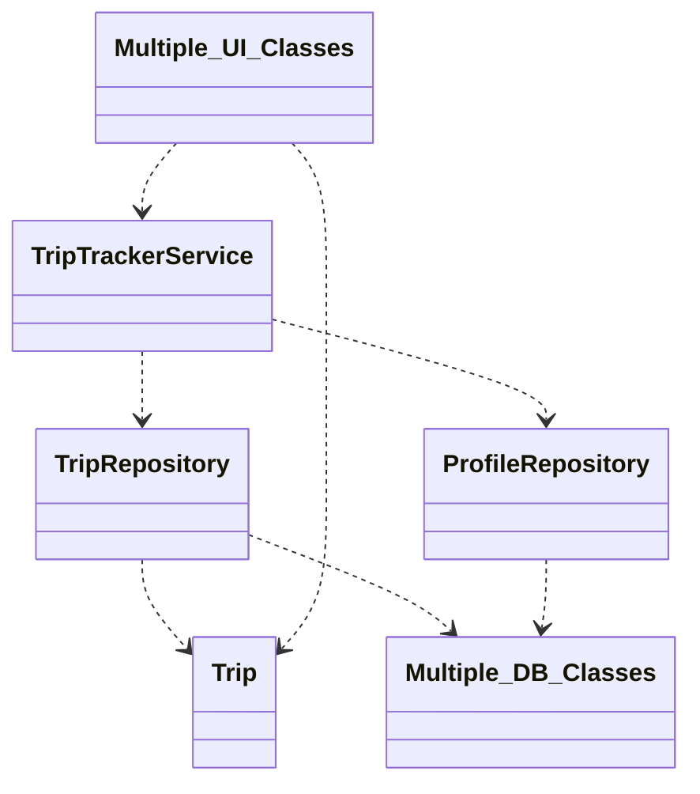
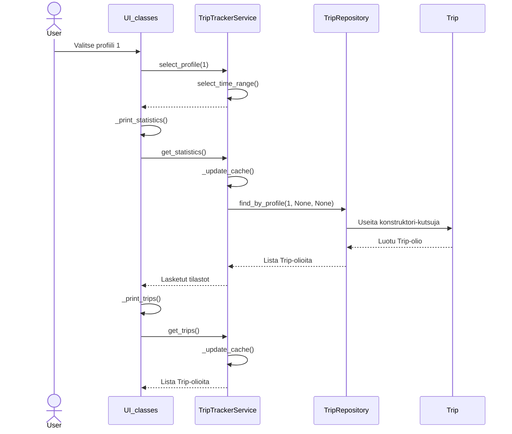
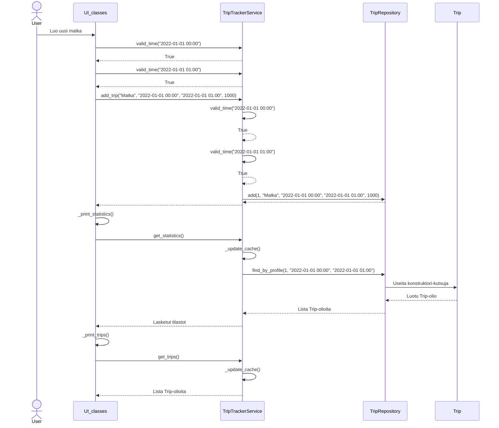

# Rakenne

# Käyttöliittymä
Käyttöliittymä koostuu kolmesta luokasta: UI, ProfileView ja TripView. UI on käyttöliittymän kokonaisuudesta vastaava luokka, jonka start-metodilla käynnistetään käyttöliittymä. Kaksi muuta luokkaa edustavat ohjelman kahta eri näkymää: profiilit ja matkat. Kumpikin luokka vastaa täysin omasta näkymästään ja UI-luokka hallitsee mikä näkymä on millonkin näkyvillä. Sovelluslogiikka on pyritty irrottamaan käyttöllittymästä. Käyttöliittymä kutsuu TripTrackerService-luokan metodeja tämän saavuttamiseksi.

# Logiikka
Sovelluslogiikasta vastaa ensisijaisesti TripTrackerService-luokka, joka tarvittaessa kutsuu muiden luokkien funktioita. Ajatuksena on, että TripTrackerService-luokan metodit ovat ainoita sovelluksen toiminnallisuuteen liittyviä metodeja, joita käyttöliittymän tarvitsee kutsua. Luokka itsessään hyödyntää konstruktoriin injektoituja ProfileRepository- ja TripRepository-luokkia tietojen tallentamista ja noutamista varten. Luokkien tarkemmat suhteet näkyvät yllä olevassa rakennekaaviossa.

# Tietojen tallennus
ProfileRepository- ja TripRepository-luokat vastaavat tietojen pysyväistallennuksesta. Molemmat hyödyntävät yhteistä SQLite tietokantaa. Tiedostonimi määritellään .env tiedostossa. TripTrackerService:llä on oma välimuisti, jossa valitut matkat säilötään niin kauan kun valinta ei muutu. Tämä välttää turhia tietokantahakuja.

# Toiminnallisuudet

## Profiilin valitsemisen sekvenssikaavio
Kaaviota on yksinkertaistettu käyttöliittymän osalta ja kaikki käyttöliittymään liittyvät luokat on yhdistetty. Kaaviossa näkyy hyvin välimuistin toiminta.

## Matkan lisäämisen sekvenssikaavio
Kaaviota on yksinkertaistettu käyttöliittymän osalta ja kaikki käyttöliittymään liittyvät luokat on yhdistetty. Kaaviossa näkyy hyvin välimuistin toiminta.

