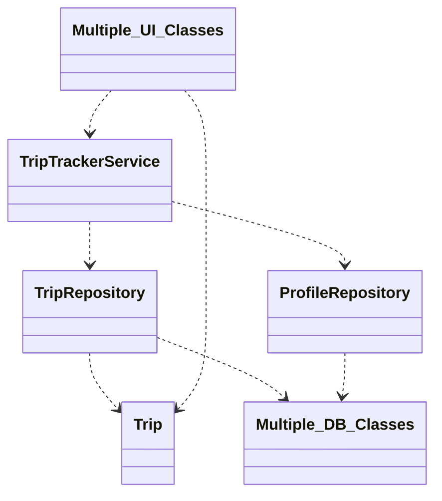
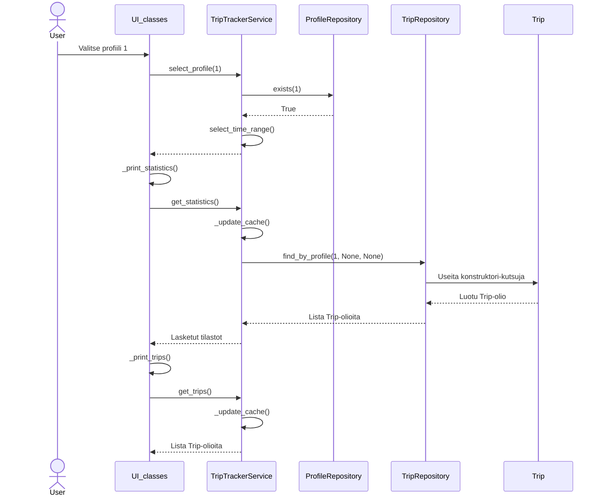
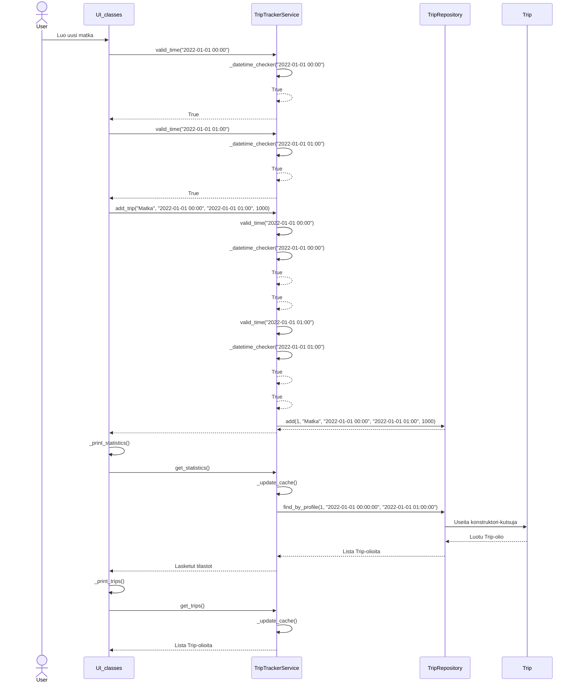

# Rakenne

# Käyttöliittymä
Käyttöliittymä koostuu kolmesta luokasta: UI, ProfileView ja TripView. UI on käyttöliittymän kokonaisuudesta vastaava luokka, jonka start-metodilla käynnistetään käyttöliittymä. Kaksi muuta luokkaa edustavat ohjelman kahta eri näkymää: profiilit ja matkat. Kumpikin luokka vastaa täysin omasta näkymästään ja UI-luokka hallitsee mikä näkymä on millonkin näkyvillä. Sovelluslogiikka on pyritty irrottamaan käyttöllittymästä. Käyttöliittymä kutsuu TripTrackerService-luokan metodeja tämän saavuttamiseksi.

# Logiikka
Sovelluslogiikasta vastaa ensisijaisesti TripTrackerService-luokka, joka tarvittaessa kutsuu muiden luokkien funktioita. Ajatuksena on, että TripTrackerService-luokan metodit ovat ainoita sovelluksen toiminnallisuuteen liittyviä metodeja, joita käyttöliittymän tarvitsee kutsua. Luokka itsessään hyödyntää konstruktoriin injektoituja ProfileRepository- ja TripRepository-luokkia tietojen tallentamista ja noutamista varten. Luokkien tarkemmat suhteet näkyvät yllä olevassa rakennekaaviossa.

# Tietojen tallennus
ProfileRepository- ja TripRepository-luokat vastaavat tietojen pysyväistallennuksesta. Molemmat hyödyntävät yhteistä SQLite tietokantaa. Tiedostonimi määritellään .env tiedostossa. TripTrackerService:llä on oma välimuisti, jossa valitut matkat säilötään niin kauan kun valinta ei muutu. Tämä välttää turhia tietokantahakuja.

# Toiminnallisuudet

## Profiilin valitsemisen sekvenssikaavio
Kaaviota on yksinkertaistettu käyttöliittymän osalta ja kaikki käyttöliittymään liittyvät luokat on yhdistetty. Kaaviossa näkyy hyvin välimuistin toiminta.

Käyttöliittymä lähettää erinnäisiä kutsuja TripTrackerService-luokalle, joka vastaa varsinaisesta toteutuksesta. Tässä tapauksessa käyttäjä on valinnut profiilin, jonka id on 1. TripTrackerService tarkistaa ensin profiilitietokannasta vastaavalta luokalta, että kyseinen profiili on olemassa, ja saa vastaukseksi True. TripTrackerService myös nollaa mahdollisen aikavälivalinnan samalla.

Käyttöliittymä pyytää TripTrackerService:ltä valittujen matkojen tilastoja käyttäjälle näytettäväksi. Valinta on muuttunut viime kerrasta (eri profiili), jolloin `_update_cache` hakee matkat uudestaan profiilin ja aikavälin perusteella TripRepositoryn avulla ja tallentaa saamansa listan Trip-olioita. Näiden perusteella lasketaan nyt tilastot, jotka palautetaan käyttöliittymälle.

Nyt käyttöliittymä haluaa näyttää itse matkat, joten se pyytää niitä TripTrackerService:ltä. Valinta ei ole tässä välissä muuttunut, jolloin `_update_cache` ei tee mitään ja TripTrackerService voi palauttaa suoraan aiemmin tallentamansa listan

## Matkan lisäämisen sekvenssikaavio
Kaaviota on yksinkertaistettu käyttöliittymän osalta ja kaikki käyttöliittymään liittyvät luokat on yhdistetty. Kaaviossa näkyy hyvin välimuistin toiminta.

Tässä tapauksessa käyttäjä haluaa lisätä uuden matkan. Käyttöliittymä hyödyntää TripTrackerService:n metodeja tarkistaakseen, että syötteet ovat kunnossa. Tämä mahdollistaa sopivan tekstikentän nollaamisen virheen sattuessa.

Varsinaisen matkan lisäämisen yhteydessä TripTrackerService tekee uudestaan tarkistukset, jotta sovelluksen toimivuus ei riipu käyttöliittymästä. Tarkistus koostuu kahdesta kutsusta, sillä sovelluksessa on käytössä kaksi eri aikaformaattia, joiden tarkistuksessa on kuitenkin merkittävästi toisteisuutta. Toisteinen koodi on siirretty luokan yksityiseen `_datetime_checker`-metodiin. Tämän jälkeen matka luodaan TripRepositoryn avulla.

Käyttöliittymä päivittää näytetyt matkat ja tilastot uuden matkan luomisen jälkeen. Tämä vastaa pitkälti edellisen kaavion loppua, joten tätä osaa ei tässä avata sen enempää. Mainitsemisen arvoista on, että tässä tapauksessa `add_trip` metodi on vastuussa siitä, että TripTrackerService:n välimuisti on merkitty vanhentuneeksi.

# Rakenteen heikkoudet
Käyttöliittymän koodi voisi olla huomattavasti siistimpää ja tyyliseikkojen muuttaminen on nyt turhan työlästä.
