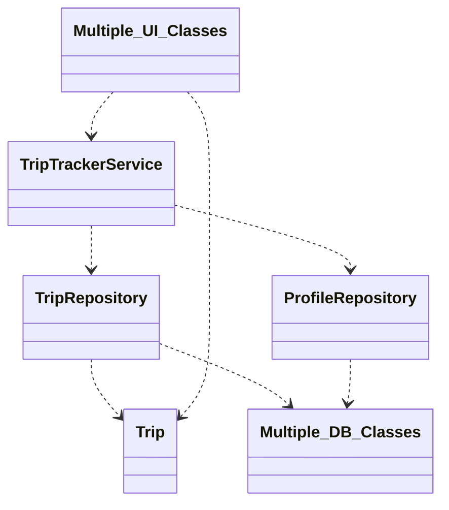
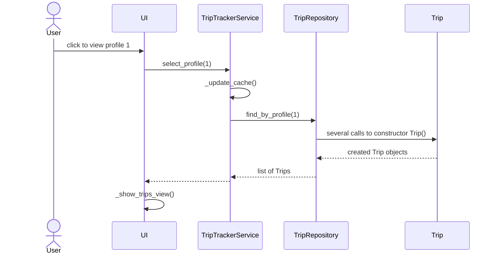

# Rakenne

```mermaid
 classDiagram
 
 	class Multiple_UI_Classes{
  }
  
  class Multiple_DB_Classes{
  }
  
	class TripTrackerService{
  }
  
  class ProfileRepository{
  }
  
  class TripRepository{
  }
  
  class Trip{
  }
  
  TripTrackerService ..> TripRepository
  TripTrackerService ..> ProfileRepository
  TripRepository ..> Trip
  Multiple_UI_Classes ..> TripTrackerService
  Multiple_UI_Classes ..> Trip
  TripRepository ..> Multiple_DB_Classes
  ProfileRepository ..> Multiple_DB_Classes
```

# Logiikka

## Profiilin valitsemisen sekvenssikaavio

```mermaid
 sequenceDiagram
 
 actor User
 User ->> UI : click to view profile 1
 
 UI ->> TripTrackerService : select_profile(1)
 TripTrackerService ->> TripTrackerService : _update_cache()
 TripTrackerService ->> TripRepository : find_by_profile(1)
 TripRepository ->> Trip : several calls to constructor Trip()
 Trip -->> TripRepository : created Trip objects
 TripRepository -->> TripTrackerService : list of Trips
 TripTrackerService -->> UI : 
 UI ->> UI : _show_trips_view()
```
