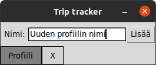
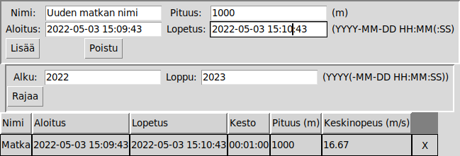
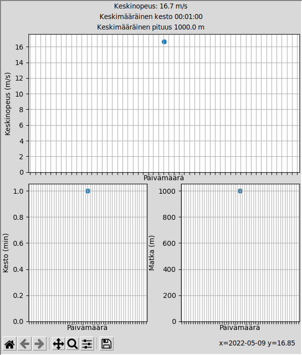

# Käyttöohje

## Lataaminen
Ohjelman uusimman vakaan version voi ladata tämän repositorion [Releases](https://github.com/ArcticCoder/trip-tracker/releases)-osiosta kohdasta _Assets > Source code_. Valitse tiedostomuodoista (zip/tar.gz) sellainen, jonka saat purettua. Jos et ole varma, zip on todennäköisesti hyvä vaihtoehto.

## Konfigurointi

Ohjelmaan liittyvät tiedot tallennetaan _data_-kansiossa olevaan .sqlite-tiedostoon. Molemmat luodaan automaattisesti asennuksen yhteydessä. Tietokantatiedoston nimeä voi muuttaa _.env_-tiedoston avulla muuttamalla seuraavaa riviä
```
DB_FILENAME=trip_tracker.sqlite
```

## Asentaminen ja Käynnistäminen

1. Asenna riippuvuudet:
```bash
poetry install
```

2. Valmistele sovellus (**POISTAA OLEMASSAOLEVAN TIETOKANNAN**):
```bash
poetry run invoke build
```

3. Ohjelman voi nyt ja aina jatkossa käynnistää suoraan komennolla:
```bash
poetry run invoke start
```

## Profiilin luominen/valinta

Ohjelman käynnistyessä avautuu profiilinvalintaikkuna. Tässä voit valita tarkasteltavan profiilin, luoda uuden profiilin tai poistaa olemassaolevan profiilin.

Uuden profiilin luominen tapahtuu syöttämälle sille nimi "Nimi"-kenttään ja painamalla "Lisää"-nappia.

Profiilin voi poistaa painamalla nimen vieressä näkyvää X-nappia. **HUOM! OHJELMA EI PYYDÄ VARMISTUSTA PROFIILIN POISTAMISEN YHTEYDESSÄ!**

Profiilin avaaminen tarkastelua varten tapahtuu painamalla profiilin nimeä.



## Matkojen hallinta

Profiilin valitsemisen jälkeen avautuu ikkuna, jossa voit tarkastella, lisätä ja poistaa profiiliin liitettyjä matkoja. Profiilinvalintaan voi palata "Poistu"-napilla. Kaikki matkat näkyvät itseselitteisesti taulukossa aikajärjestyksessä.

Matkan lisääminen tapahtuu antamalla matkalle nimi, pituus ja alku- ja loppuaika. Ajat ovat muotoa YYYY-MM-DD HH:MM(:SS), eli vuosi, kuukausi, päivä, tunnit, minuutit ja haluttaessa sekuntit. "Lisää"-nappi lisää matkan annetuilla tiedoilla. Jos jokin tieto ei ole oikeanlainen, ohjelma ei lisää matkaa, vaan nollaa kyseisen kentän alkuperäiseen tilaan.

Matkan voi poistaa samalla tavalla kuin profiilin eli painamalla matkan vieressä näkyvää X-nappia.

Taulukossa ja tilastoissa näkyvät matkat voi rajata tietylle aikavälille syöttämällä halutun alun, lopun tai molemmat ja painamalla "Rajaa"-nappia. Aikojen muoto on sama kuin matkojen lisäämisessä, mutta rajaamisessa kaikki vuoden jälkeen on vapaaehtoista. Loppupiste tulkitaan siten, että esimerkiksi "2022-02" ottaa mukaan kaikki ajat, jotka alkoivat vuoden 2022 Helmikuussa, tai aiemmin. Tekstikentän tyhjentäminen ja "Rajaa"-napin painaminen poistavat alku-/loppupisteen rajaukselta. Tyhjentämällä molemmat ja painamalla nappia pääsee siis takaisin rajaamattomaan tilaan.



## Tilastot

Ikkunan vasemmassa laidassa näkyy valituista matkoista laskettuja tilastoja. Tilastot itsessään ovat itseselitteisiä. Kun asetat hiiren kuvaajan päälle, näet tilastoalueen oikeassa alakulmassa pisteen tarkat X- ja Y-koordinaatit. Alueen vasemmassa alanurkassa on nappeja tilastonäkymän hallintaa varten. Järjestyksessä vasemmalta oikealle:

 - Palauttaa näkymän alkuperäiseen tilaan
 - Eteen- ja taaksepäin-napit, joilla ei tässä tapauksessa tee mitään
 - Näkymän siirtelyyn tarkoitettu työkalu
 - Näkymän rajaaminen tiettyyn alueeseen
 - Kuvaajien asetuksien säätäminen, ei yleensä mielekäs
 - Näkymän tallentaminen kuvana


