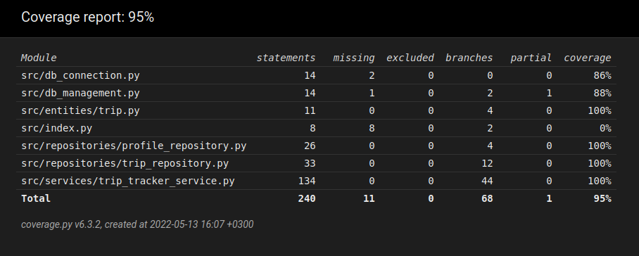

# Testaus

Yksittäisten metodien toimivuus on pyritty varmistamaan unittestillä toteutetuilla yksikkötesteillä, sekä yhdellä koko järjestelmää testaavalla integraatiotestillä. Ohjelman [rakenne](https://github.com/ArcticCoder/trip-tracker/blob/master/dokumentaatio/arkkitehtuuri.md) on sellainen, että TripTrackerService-luokan kattava testaaminen tulee käytännössä testanneeksi koko sovelluskokonaisuuden (poislukien käyttöliittymä) toimivuuden.

Valmista järjestelmää on myös testattu manuaalisesti.

## Unittest

### Repositoriot

Repositorioita testataan pytest.ini-tiedostossa määriteltyä .env-tiedostoa (oletuksena .env.test), jossa määritellään testaamiseen käytettävän tietokannan tiedostonimi. Kummallakin Repository-luokalla on oma vastaava `Test` alkuinen testiluokka.

### Sovelluslogiikka

Sovelluslogiikasta vastaa TripTrackerService, jolla on oma TestTripTrackerService testiluokka. Testaaminen tapahtuu käyttämällä aitoja Repository-luokkia, joka johtaa siihen että luokan testaaminen testaa hyvin koko sovelluksen toimivuutta.

### Testikattavuus

Haaraumakattavuus on 95%. Käyttöliittymä on jätetty testikattavuuden ulkopuolelle. Testaamatta jäävät tietokannan alustaminen komentoriviltä, .env tieodoston puuttuminen ja index.py.

## Manuaalinen testaaminen

[Käyttöohjeen](https://github.com/ArcticCoder/trip-tracker/blob/master/dokumentaatio/kayttoohje.md) ja  [vaatimusmäärittelyn](https://github.com/ArcticCoder/trip-tracker/blob/master/dokumentaatio/vaatimusmaarittely.md) mukainen asentaminen ja käyttäminen on pyritty testaamaan manuaalisesti mahdollisimman kattavasti oikeilla ja virheellisillä syötteillä. Testaaminen on tapahtunut Helsingin Yliopiston Cubbli-linux käyttöjärjestelmällä.

## Tiedossa olevat ongelmat

Ohjelma antaa kehnosti palautetta käyttäjälle. Esimerkiksi virheellisen syötteen kenttä tyhjennetään automaattisesti, mutta selkeämpi ilmaisu tapahtuneesta virheestä olisi hyvä.
