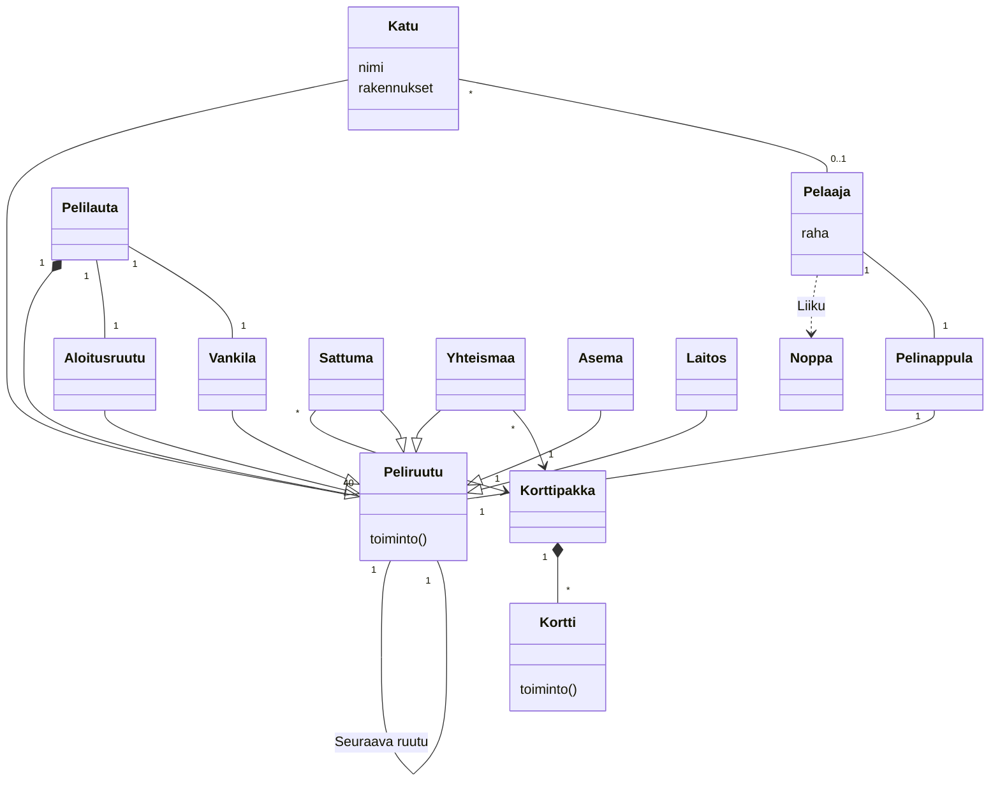

# Tehtävä 2 - Laajannettu Monopoli

```mermaid
 classDiagram
	

	class Noppa

  Pelaaja ..> Noppa : Liiku
	Pelaaja "1" -- "1" Pelinappula
	class Pelaaja{
  raha
  }

	Pelilauta "1" *-- "40" Peliruutu
  Pelilauta "1" -- "1" Aloitusruutu
  Pelilauta "1" -- "1" Vankila
	class Pelilauta

	
	Peliruutu "1" -- "1" Peliruutu : Seuraava ruutu
	class Peliruutu{
    toiminto()
  }
  
  Pelinappula "1" -- "1" Peliruutu
	class Pelinappula
  
  Aloitusruutu --|> Peliruutu
  class Aloitusruutu
  
  Vankila --|> Peliruutu
  class Vankila
  
  Sattuma "*" --> "1" Korttipakka
  Sattuma --|> Peliruutu
  class Sattuma
  
  Yhteismaa --|> Peliruutu
  Yhteismaa "*" --> "1" Korttipakka
  class Yhteismaa
  
  Asema --|> Peliruutu
  class Asema
  
  Laitos --|> Peliruutu
  class Laitos
  
  Katu --|> Peliruutu
  Katu "*" -- "0..1" Pelaaja
  class Katu{
  nimi
  rakennukset
  }
  
  Korttipakka "1" *-- "*" Kortti
  
  class Kortti{
    toiminto()
  }
```
