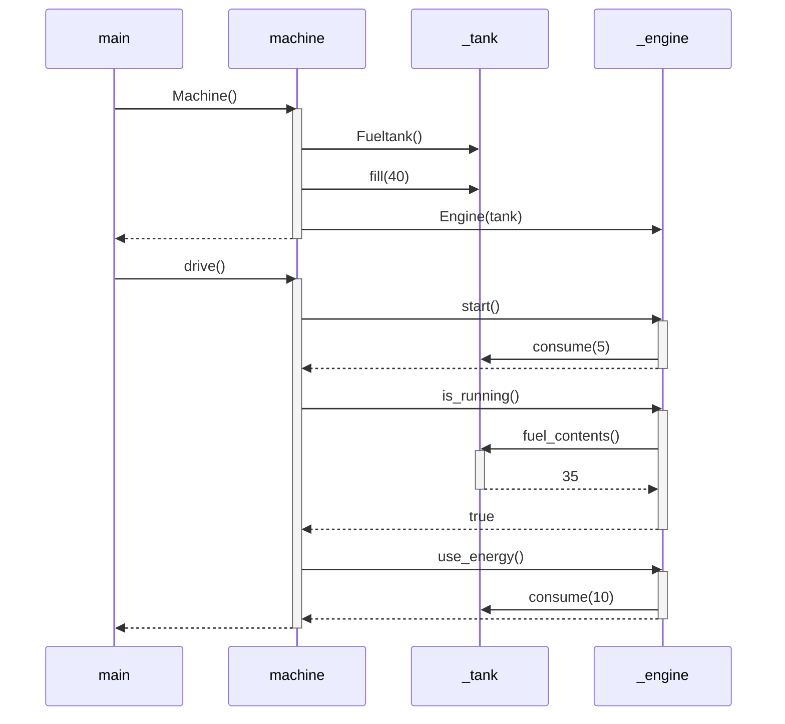

# Tehtävä 3 - Sekvenssikaavio

```mermaid
 sequenceDiagram
 
 
 main ->> machine : Machine()
 
 activate machine
 machine ->> _tank : Fueltank()
 machine ->> _tank : fill(40)
 machine ->> _engine : Engine(tank)
 machine -->> main : 
 deactivate machine
 
 main ->> machine : drive()
 activate machine
 
 machine ->> _engine : start()
 activate _engine
 _engine ->> _tank : consume(5)
 _engine -->> machine : 
 deactivate _engine
 
 machine ->> _engine : is_running()
 activate _engine
 _engine ->> _tank : fuel_contents()
 activate _tank
 _tank -->> _engine : 35
 deactivate _tank
 _engine -->> machine : true
 deactivate _engine
 
 machine ->> _engine : use_energy()
 activate _engine
 _engine ->> _tank : consume(10)
 _engine -->> machine : 
 deactivate _engine
 
 machine -->> main : 
 deactivate machine
 
```
